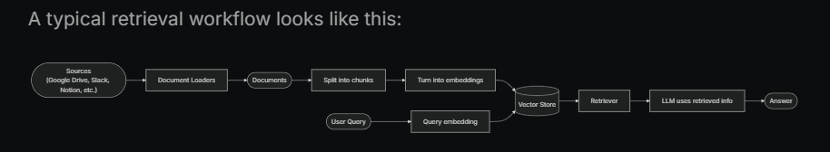
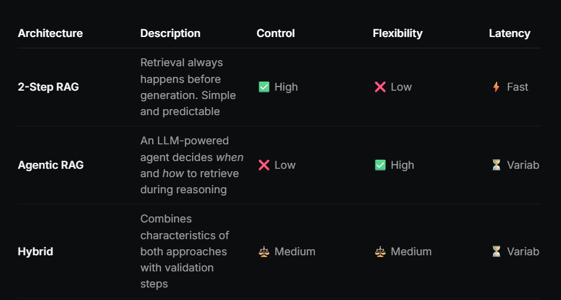

**DAY 3**

**LangChain + LangGraph**

**1. Nodes**
- In LangGraph, nodes are Python functions (either synchronous or asynchronous) that accept the following arguments:
    - state – The state of the graph
        - In layman terms, states holds the current info.
    - config – A RunnableConfig object that contains configuration information like thread_id and tracing information like tags
        - This is extra setup or settings information for how the node should run.
    - runtime – A Runtime object that contains runtime context and other information like store and stream_writer.
        - This gives access to tools and environment details while the node is running.

**2. Graphs**
- At its core, LangGraph models agent workflows as graphs. You define the behavior of your agents using three key components:
    - State: A shared data structure that represents the current snapshot of your application. It can be any data type, but is typically defined using a shared state schema.
    - Nodes: Functions that encode the logic of your agents. They receive the current state as input, perform some computation or side-effect, and return an updated state.
    - Edges: Functions that determine which Node to execute next based on the current state. They can be conditional branches or fixed transitions.
    - In short: nodes do the work, edges tell what to do next.

**3. START Node**
- The START Node is a special node that represents the node that sends user input to the graph.
- The main purpose for referencing this node is to determine which nodes should be called first.

**4. END Node**
- The END Node is a special node that represents a terminal node. 
- This node is referenced when you want to denote which edges have no actions after they are done.

**5. Edges**
- Edges define how the logic is routed and how the graph decides to stop.
    - Normal Edges: Go directly from one node to the next.
    - Conditional Edges: Call a function to determine which node(s) to go to next.
    - Entry Point: Which node to call first when user input arrives.
    - Conditional Entry Point: Call a function to determine which node(s) to call first when user input arrives.

**6. Reducers**
- Reducers are key to understanding how updates from nodes are applied to the State. 
- Each key in the State has its own independent reducer function.

**7. Retrieval**

**RAG Architectures**

**The chains page in langchain is under maintenance**

Sources- LangChain Documentation(https://docs.langchain.com/oss/python/langgraph/graph-api#nodes, https://docs.langchain.com/oss/python/langgraph/graph-api#graphs, ), ChatGPT(chatgpt.com), 